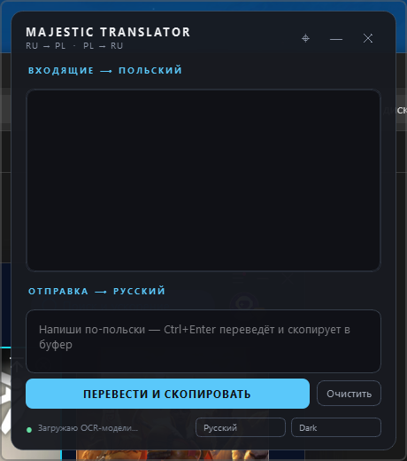

# Majestic Translator

> Nakładkowy tłumacz czatu w czasie rzeczywistym dla [Majestic RP](https://majestic-rp.ru/) i innych serwerów multiplayer GTA V. Odczytuje czat w grze przez ekranowe OCR, tłumaczy z rosyjskiego na polski (lub dowolną parę, którą skonfigurujesz), a Twoją odpowiedź po polsku zamienia na rosyjski i wkleja do schowka — gotowe do wklejenia z powrotem do czatu.

[Русский](README.ru.md) · **Polski** · [English](README.md)



---

## Po co

Serwer rosyjskojęzyczny, gracz polskojęzyczny. Albo odwrotnie. Albo uczysz się języka. Oficjalny klient nie ma tłumaczenia, zewnętrzne tłumacze nie czytają czatu, a kopiowanie wiadomości z gry niszczy immersję RP.

Majestic Translator to małe okienko zawsze na wierzchu, obok gry. Po cichu OCR-uje obszar czatu, każdą nową linię puszcza przez Google Translate i pokazuje w kolejności pojawiania się. Kierunek odwrotny — przez pole tekstowe i schowek systemowy.

## Funkcje

- 🎯 **OCR po wybranym obszarze** — kalibrujesz raz, wskazujesz panel czatu; działa w każdej rozdzielczości.
- ⚡ **Pomijanie identycznych klatek** — gdy czat się nie zmienia, OCR nie pracuje, aplikacja stoi na ~0% CPU.
- 🧠 **Inteligentne łączenie wiadomości** — długie zawijane reguły są sklejane z powrotem; etykiety UI i własne okno aplikacji są maskowane przed rozpoznawaniem.
- 🚀 **Równoległe nieblokujące tłumaczenie** — wolne wywołania Google nigdy nie zatrzymują przechwytywania czatu; wyniki wychodzą w oryginalnej kolejności czatu.
- 🌍 **3 języki UI** — rosyjski, polski, angielski.
- 🎨 **3 motywy** — Majestic (ciemny + złoto), Dark (grafit), Light (biały).
- 🪶 **Natywne okno bez ramki** — przeciąganie przez API systemu, bez rwanego ręcznego pętlenia.
- 🔓 **Bez kluczy API** — używa publicznego endpointu Google Translate (tego samego, którego używa "Przetłumacz tę stronę" w Chrome).

## Szybki start

### Wariant A — instalator (Windows)

1. Pobierz `MajesticTranslator-Setup.exe` z sekcji [Releases](../../releases).
2. Uruchom, akceptuj domyślne ustawienia, gotowe.
3. Uruchom z menu Start.
4. Przy pierwszym uruchomieniu zaznacz myszką obszar czatu w grze.

### Wariant B — z kodu źródłowego

Potrzebujesz **Python 3.11+** i połączenia z internetem (modele OCR pobiorą się raz, ~150 MB).

```powershell
git clone https://github.com/<twoj-user>/majestic-translator.git
cd majestic-translator

python -m venv .venv
.\.venv\Scripts\Activate.ps1
pip install -r requirements.txt

python main.py
```

Przy pierwszym uruchomieniu na ekranie pojawi się półprzezroczysta nakładka — zaznacz myszką obszar czatu, puść przycisk. Współrzędne zostaną zapisane w `config.json` i użyte ponownie przy następnym uruchomieniu.

## Użycie

### Czytanie czatu z gry

Po prostu graj. Co ~1 sekundę okno OCR-uje obszar czatu, wybiera nowe linie po rosyjsku, tłumaczy na polski i dokleja do listy (najnowsze na dole).

- **Oryginał** jest pokazywany wyblakły pod każdym tłumaczeniem.
- Lista przechowuje ostatnie 40 wiadomości.
- Pasek statusu pokazuje stan OCR/tłumaczenia.

### Wysyłanie polski → rosyjski

1. Wpisz polską wiadomość w pole na dole.
2. Wciśnij **Ctrl+Enter** (albo kliknij **PRZETŁUMACZ I SKOPIUJ**).
3. Rosyjskie tłumaczenie zostanie skopiowane do schowka.
4. W grze: **T** → otwórz czat, **Ctrl+V** → wklej, **Enter** → wyślij.

### Zmiana języka i motywu

Pasek statusu na dole ma dwie listy rozwijane:

- **Język**: język interfejsu (Русский / Polski / English). Kierunek tłumaczenia czatu jest niezależny — to nadal RU ↔ PL.
- **Motyw**: Majestic (ciemny + złoto), Dark (neutralny grafit), Light (biały).

Oba wybory są natychmiast zapisywane w `config.json`.

### Ponowna kalibracja obszaru czatu

Ikona **⌖** w pasku tytułu. Pojawi się znowu nakładka — zaznacz nowy obszar.

## Konfiguracja

`config.json` jest tworzony obok pliku wykonywalnego przy pierwszym uruchomieniu:

| Klucz | Opis | Domyślnie |
|---|---|---|
| `chat_region` | Obszar OCR w pikselach ekranu | (ustawiany przy kalibracji) |
| `ocr_interval_ms` | Interwał odpytywania czatu. Niżej = szybsza reakcja, większe CPU | `1000` |
| `overlay_pos` / `overlay_size` | Geometria okna | przywracana między uruchomieniami |
| `source_lang` / `target_lang` | Kierunek tłumaczenia czatu | `ru` → `pl` |
| `input_lang` / `input_target_lang` | Kierunek tłumaczenia pola odpowiedzi | `pl` → `ru` |
| `language` | Język UI: `ru` \| `pl` \| `en` | `ru` |
| `theme` | Motyw: `majestic` \| `dark` \| `light` | `majestic` |

## Jak to działa

```
                ┌─────────────────────────┐
                │  Majestic RP / GTA V    │
                │  ┌───────────────────┐  │
   obszar czatu │  │     czat w grze   │  │
   ═════════════╪══╪═══════════════════╪══╪═══
                │  │  [HH:MM] reply…   │  │
                │  └───────────────────┘  │
                └─────────────┬───────────┘
                              │ mss.grab()
                              ▼
                    ┌─────────────────┐
                    │  diff klatek    │── bez zmian ──▶ koniec
                    └────────┬────────┘
                             │ zmiana
                             ▼
                    ┌─────────────────┐
                    │ PaddleOCR (ru)  │── linie + ramki
                    │ mobile det+rec  │
                    └────────┬────────┘
                             ▼
                    ┌─────────────────┐
                    │ łączenie po «-» │── linie czatu
                    └────────┬────────┘
                             ▼
                    ┌─────────────────┐
                    │ dedup [HH:MM]   │── nowe linie
                    └────────┬────────┘
                             │ numer seq
                             ▼
                    ┌─────────────────┐
                    │ pula tłumaczeń  │── równolegle × 4
                    │ Google /gtx     │   uporządkowany emit
                    └────────┬────────┘
                             ▼
                       lista w oknie
```

Najważniejsze:
- **Model detekcji**: `PP-OCRv5_mobile_det` (~10 MB, ~150 ms/cykl na CPU).
- **Model rozpoznawania**: `eslav_PP-OCRv5_mobile_rec` (wschodniosłowiański — rosyjski / ukraiński / białoruski).
- **Tłumaczenie**: bezpośrednie wywołanie `translate.googleapis.com/translate_a/single?client=gtx`. Ten sam endpoint, którego używa Chrome do tłumaczenia stron. Bez klucza API.
- **Wątki**: pętla OCR nigdy nie czeka na tłumaczenie — wolne wywołania Google nie blokują przechwytywania czatu. `ThreadPoolExecutor` puszcza tłumaczenia równolegle; bufor z numerami seq odtwarza pierwotną kolejność.

## Budowanie ze źródeł

Potrzeba:
- Python 3.11 lub 3.12
- ~5 GB wolnego miejsca na artefakty
- (Opcjonalnie) [Inno Setup 6](https://jrsoftware.org/isdl.php) do wygenerowania instalatora

```powershell
.\.venv\Scripts\Activate.ps1
pip install -r requirements.txt pyinstaller

# 1. Zbuduj folder dist
pyinstaller build/MajesticTranslator.spec --noconfirm

# 2. (Opcjonalnie) Zapakuj w instalator Windows
"%ProgramFiles(x86)%\Inno Setup 6\ISCC.exe" installer\installer.iss
```

Wyjście:
- `dist/MajesticTranslator/` — folder z aplikacją, ~700 MB rozpakowane
- `installer/output/MajesticTranslator-Setup.exe` — pojedynczy plik instalatora, ~250 MB

## Prywatność / co idzie do sieci

- **Modele OCR** pobierają się raz z oficjalnego mirroru PaddleOCR (~150 MB, cache w `%USERPROFILE%\.paddlex\`).
- **Tłumaczenia** trafiają do publicznego endpointu Google przez HTTPS. Każda rozpoznana linia czatu jest wysyłana jako parametr query-stringu. Brak telemetrii, brak analityki. Kod w `app/translator.py:23`, gdyby ktoś chciał zweryfikować.
- **Nigdzie indziej nic nie jest wysyłane.**

## Ograniczenia

- **Antycheat**: Majestic RP używa RAGE Multiplayer z własnym antycheatem. Ta aplikacja tylko **czyta** ekran i podstawia schowek — nie wstrzykuje się do gry ani jej nie modyfikuje. Ale polityki innych serwerów RP mogą się różnić; sprawdź zasady przed użyciem.
- **Dokładność OCR** nie jest idealna na stylizowanych czcionkach czatu. Czasem nicki i tagi frakcji wychodzą poprzekręcane (`Фракция` → `Фрakция` itp.). Sama treść wiadomości zazwyczaj jest OK.
- **Limity Google**: przy bardzo dużym wolumenie (~> 30 linii/min stale) publiczny endpoint Google może zacząć ograniczać. Zwiększ interwał OCR lub podłącz płatny backend.
- **Najpierw jeden monitor**: działa na wielu monitorach, ale nakładka kalibracyjna pojawia się tylko na monitorze głównym.

## Wkład

Issues i PR-y mile widziane. Kod jest niewielki (~1000 linii), struktura prosta:

```
app/
├── config.py        # zapis konfiguracji JSON
├── i18n.py          # tłumaczenia UI (RU/PL/EN)
├── themes.py        # trzy palety Qt
├── ocr.py           # mss → PaddleOCR → łączenie → dedup
├── translator.py    # bezpośredni klient Google /gtx + ochrona nicków/komend RP
├── workers.py       # nieblokujący równoległy pipeline (sygnały Qt)
├── region_picker.py │── nakładka pełnoekranowa do kalibracji
└── overlay.py       # główne okno bez ramki PySide6
main.py              # punkt wejścia: ładowanie konfigu, kalibracja jeśli trzeba, pokaz
```

## Licencja

MIT — patrz [LICENSE](LICENSE).

## Podziękowania

- [PaddleOCR](https://github.com/PaddlePaddle/PaddleOCR) za wschodniosłowiański model rozpoznawania.
- [PySide6](https://wiki.qt.io/Qt_for_Python) za plumbing okna bez ramki.
- [mss](https://github.com/BoboTiG/python-mss) za szybkie przechwytywanie ekranu.
- [Inno Setup](https://jrsoftware.org/isinfo.php) za pakowanie instalatora.

Niezależny od Majestic RP, Rockstar Games ani Take-Two Interactive. GTA V jest znakiem towarowym Rockstar Games.
